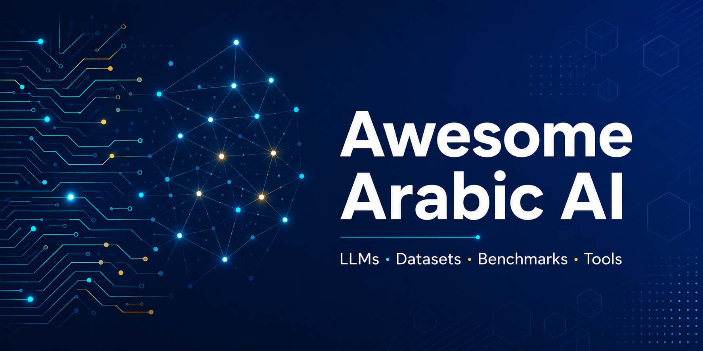

 

# 🌟 Awesome Arabic AI 

  <strong>A curated list of awesome Arabic Artificial Intelligence resources</strong>
   
  <em>LLMs · Datasets · Benchmarks · Speech · OCR · Tools · Research</em>
    
  <strong>قائمة منسقة لأفضل موارد الذكاء الاصطناعي العربي</strong>
   
  <em>نماذج لغوية · بيانات · تقييمات · صوت · رؤية · أدوات · أبحاث</em>

---

## 📖 About | عن المشروع

The Arabic language is spoken by over **400 million people** worldwide, yet remains significantly underrepresented in the AI ecosystem. This repository aims to be the **single source of truth** for Arabic AI resources — bringing together state-of-the-art models, datasets, benchmarks, tools, and research from across the MENA region and beyond.

اللغة العربية يتحدث بها أكثر من **400 مليون شخص** حول العالم، لكنها لا تزال ممثَّلة بشكل ضعيف في منظومة الذكاء الاصطناعي. يهدف هذا المستودع إلى أن يكون **المرجع الموحَّد** لموارد الذكاء الاصطناعي العربي، جامعاً أحدث النماذج والبيانات وأدوات التقييم والأبحاث من المنطقة العربية والعالم.

> 💡 **Found this useful?** Give it a ⭐ to help others discover it!
> 💡 **هل أفادك المحتوى؟** ضع نجمة ⭐ لمساعدة الآخرين على اكتشافه!

---

## 📑 Contents | المحتويات

- [🤖 Large Language Models (LLMs)](#-large-language-models-llms)
  - [Open-Source General Models](#open-source-general-models)
  - [Dialectal Arabic LLMs](#dialectal-arabic-llms)
  - [Commercial & Closed Models](#commercial--closed-models)
  - [Foundational & Encoder Models](#foundational--encoder-models)
  - [Fine-tuned & Specialized Models](#fine-tuned--specialized-models)
- [📊 Datasets](#-datasets)
  - [Pre-training Datasets](#pre-training-datasets)
  - [Instruction & SFT Datasets](#instruction--sft-datasets)
  - [Dialectal Arabic Datasets](#dialectal-arabic-datasets)
  - [Domain-Specific Datasets](#domain-specific-datasets)
  - [Dataset Catalogs](#dataset-catalogs)
- [🏆 Benchmarks & Leaderboards](#-benchmarks--leaderboards)
- [🔊 Speech & Audio](#-speech--audio)
  - [Speech Recognition (ASR)](#speech-recognition-asr)
  - [Text-to-Speech (TTS)](#text-to-speech-tts)
- [👁️ Vision & OCR](#️-vision--ocr)
- [🛠️ Libraries & Tools](#️-libraries--tools)
- [📚 Research Papers & Surveys](#-research-papers--surveys)
- [🎓 Courses & Tutorials](#-courses--tutorials)
- [🏢 Companies & Startups](#-companies--startups)
- [🌐 Communities & Conferences](#-communities--conferences)
- [📰 Blogs & Newsletters](#-blogs--newsletters)
- [🤝 Contributing](#-contributing)
- [📜 License](#-license)

## 🤖 Large Language Models (LLMs)

State-of-the-art Arabic and multilingual language models with strong Arabic capabilities.

### Open-Source General Models

- **[Jais](https://huggingface.co/inceptionai)** — Family of bilingual Arabic-English LLMs (590M to 70B parameters) developed by Inception (G42), Cerebras, and MBZUAI. Apache 2.0 license. One of the most influential Arabic LLMs.
- **[Jais 2](https://huggingface.co/inceptionai/Jais-2-70B-Chat)** — Next-generation Arabic open-weight LLM (8B and 70B) released December 2025 by Inception, Cerebras, and MBZUAI. Trained on the largest Arabic-first dataset ever assembled.
- **[Fanar-1](https://huggingface.co/QCRI)** — 9B parameter Arabic-focused LLM by QCRI (Qatar). Open weights under Apache 2.0. Strong performance on cultural and dialectal tasks.
- **[Fanar 2.0](https://www.fanar.qa/en)** — 27B parameter upgraded Arabic-centric multimodal model by QCRI (2025), supporting language, speech, and image generation.
- **[ALLaM-7B](https://huggingface.co/humain-ai/ALLaM-7B-Instruct-preview)** — 7B model by SDAIA (Saudi Data and AI Authority). Apache 2.0. Optimized for Modern Standard Arabic and Saudi dialects.
- **[ALLaM-34B](https://huggingface.co/papers/2508.17378)** — 34B parameter Arabic-centric LLM by HUMAIN. Top-ranked on Stanford HELM for Arabic accuracy.
- **[AceGPT](https://github.com/FreedomIntelligence/AceGPT)** — 7B/13B Arabic LLM by KAUST with RLAIF-based instruction tuning. Strong cultural alignment.
- **[AceGPT-v2](https://github.com/FreedomIntelligence/AceGPT-v2)** — Improved Arabic LLMs (8B, 32B, 70B) with alignment at pre-training. Available on [Hugging Face](https://huggingface.co/FreedomIntelligence/AceGPT-v2-8B).
- **[Falcon-Arabic](https://huggingface.co/blog/tiiuae/falcon-arabic)** — TII's first Arabic model in the Falcon series (May 2025). Excels at Arabic grammar, reasoning, and code-switching. [Falcon LLM Site](https://falconllm.tii.ae/)
- **[Falcon-H1](https://falconllm.tii.ae/)** — TII's best-in-class high-performance hybrid model with strong Arabic capabilities.
- **[SILMA-9B-Instruct-v1.0](https://huggingface.co/silma-ai/SILMA-9B-Instruct-v1.0)** — Top-ranked open-weights Arabic LLM (until Feb 2025) based on Gemma. Apache 2.0 license.
- **[Mistral Saba](https://mistral.ai/news/mistral-saba)** — 24B parameter model by Mistral AI (Feb 2025) specifically designed for Arabic and South Asian languages.
- **[Command R7B Arabic](https://huggingface.co/CohereLabs/c4ai-command-r7b-arabic-02-2025)** — 7B open-weight Arabic-optimized model by Cohere Labs (Feb 2025). [Technical Report](https://arxiv.org/html/2503.14603v1)
- **[Aya & Aya Expanse](https://huggingface.co/CohereLabs/aya-101)** — Cohere's multilingual model supporting 101+ languages with strong Arabic support.
- **[Yehia-7B](https://huggingface.co/Navid-AI/Yehia-7B-preview)** — Fine-tuned Arabic LLM by Navid AI, based on ALLaM. Top-performing on multiple Arabic benchmarks.
- **[Pronoia LLM](https://tarjama.com/introducing-pronoia-llm-the-arabic-ai-engine-built-for-enterprise-excellence/)** — Tarjama's enterprise-focused Arabic LLM (7B and 14B variants). Ranked #1 on Open Arabic LLM Leaderboard.
- **[Mulhem](https://watadict.com/mulhem/)** — First Saudi domain-specific LLM by Watad, trained exclusively on Saudi data sets.
- **[Noor](https://www.tii.ae/news/technology-innovation-institute-launches-noor-worlds-largest-arabic-nlp-model)** — Large-scale Arabic NLP model by TII (10B parameters, 2022).
- **[Arabic-Sahm](https://huggingface.co/NAMAA-Space)** — Arabic language model by NAMAA-Space.

### Dialectal Arabic LLMs

- **[Atlas-Chat](https://huggingface.co/MBZUAI-Paris/Atlas-Chat-9B)** — First family of LLMs specifically developed for Moroccan Darija. Available in [2B](https://huggingface.co/MBZUAI-Paris/Atlas-Chat-2B), [9B](https://huggingface.co/MBZUAI-Paris/Atlas-Chat-9B), and [27B](https://huggingface.co/MBZUAI-Paris/Atlas-Chat-27B) by MBZUAI-Paris. [Paper](https://arxiv.org/abs/2409.17912)
- **[Nile-Chat](https://huggingface.co/collections/MBZUAI-Paris/nile-chat)** — Family of LLMs for Egyptian dialect handling both Arabic and Latin scripts. Available in [4B](https://huggingface.co/MBZUAI-Paris/Nile-Chat-4B), [12B](https://huggingface.co/MBZUAI-Paris/Nile-Chat-12B), and [3x4B-A6B (MoE)](https://huggingface.co/MBZUAI-Paris/Nile-Chat-3x4B-A6B). [Paper](https://arxiv.org/abs/2507.04569)
- **[AL Atlas](https://www.atlasia.ma/blog/al-atlas-pretraining)** — Moroccan Darija pretraining by AtlasIA.
- **[Lahjawi](https://aclanthology.org/2025.wacl-1.2.pdf)** — First cross-dialect translation model, covering 15 distinct Arabic dialects.

### Commercial & Closed Models

- **[Cohere Command-R / Command-A](https://cohere.com/)** — Strong multilingual model with excellent Arabic support and improved Arabic dialect matching.
- **[GPT-4 / GPT-4o](https://openai.com/)** — Leading commercial model with strong Arabic capabilities.
- **[Claude (Anthropic)](https://www.anthropic.com/)** — Excellent Arabic comprehension and generation.
- **[Gemini](https://gemini.google.com/)** — Google's multilingual model with native Arabic support.
- **[Fanar (Closed)](https://www.fanar.qa/en)** — Qatar's flagship Arabic GenAI platform.

### Foundational & Encoder Models

- **[AraBERT](https://github.com/aub-mind/arabert)** — BERT-based Arabic language understanding model by AUB MIND Lab. Foundational work, still widely used.
- **[AraGPT2](https://github.com/aub-mind/arabert)** — GPT-2 variants pre-trained on Arabic by AUB MIND Lab.
- **[AraT5](https://github.com/UBC-NLP/araT5)** — T5-style text-to-text Transformer for Arabic language generation. Available on [Hugging Face](https://huggingface.co/UBC-NLP/AraT5-base). [Paper](https://arxiv.org/abs/2109.12068)
- **[AraELECTRA](https://github.com/aub-mind/arabert)** — ELECTRA-based Arabic language model by AUB MIND Lab.
- **[CAMeLBERT](https://github.com/CAMeL-Lab/CAMeLBERT)** — Suite of BERT models for Arabic variants (MSA, DA, CA) by Columbia/NYU's CAMeL Lab.
- **[MARBERT / ARBERT](https://github.com/UBC-NLP/marbert)** — Arabic-focused BERT variants by UBC-NLP.

### Fine-tuned & Specialized Models

- **[Arabic-Orca](https://huggingface.co/models?search=arabic-orca)** — Arabic instruction-tuned variants of Orca.
- **[Arabic-Mistral](https://huggingface.co/models?search=arabic+mistral)** — Community fine-tunes of Mistral on Arabic data.
- **[Arabic-Llama variants](https://huggingface.co/models?search=arabic+llama)** — Various Llama models fine-tuned for Arabic.

---

## 📊 Datasets

High-quality datasets for training, fine-tuning, and evaluating Arabic AI models.

### Pre-training Datasets

- **[101 Billion Arabic Words Dataset](https://huggingface.co/datasets/ClusterlabAi/101_billion_arabic_words_dataset)** — Massive web-scale Arabic corpus, one of the largest publicly available.
- **[ArabicWeb24](https://lighton.ai/fr-blog-posts/arabicweb24-creating-a-high-quality-arabic-web-only-pre-training-dataset)** — Curated, deduplicated web crawl of Arabic content from 2024.
- **[FineWeb2 Arabic](https://huggingface.co/collections/Omartificial-Intelligence-Space/huggingface-fineweb2-arabic-dataset-portions)** — Comprehensive curated Arabic portions of FineWeb2.
- **[OSCAR Arabic](https://oscar-project.org/)** — Multilingual web corpus with a substantial Arabic subset.
- **[mC4 Arabic](https://huggingface.co/datasets/mc4)** — Arabic portion of Google's multilingual C4.
- **[Arabic Wikipedia Dumps](https://dumps.wikimedia.org/arwiki/)** — Clean Arabic encyclopedia content.

### Instruction & SFT Datasets

- **[CIDAR](https://huggingface.co/datasets/arbml/CIDAR)** — High-quality Arabic instruction-tuning dataset, culturally aligned.
- **[Arabic Alpaca](https://huggingface.co/datasets?search=arabic+alpaca)** — Arabic translations of the Alpaca instruction dataset.
- **[InstAr-500k](https://huggingface.co/datasets/ClusterlabAi/InstAr-500k)** — 500k Arabic instructions for SFT.
- **[Arabic Dolly](https://huggingface.co/datasets?search=arabic+dolly)** — Arabic version of the Dolly instruction dataset.
- **[Egyptian-SFT-Mixture](https://huggingface.co/datasets/MBZUAI-Paris/Egyptian-SFT-Mixture)** — 1.85M Egyptian Arabic SFT examples by MBZUAI-Paris.
- **[Darija-SFT-Mixture](https://huggingface.co/collections/guokan-shang/atlas-chat-for-moroccan-darija)** — Moroccan Darija SFT collection.

### Dialectal Arabic Datasets

- **[MADAR](https://camel.abudhabi.nyu.edu/madar/)** — Multi-Arabic Dialect Applications and Resources covering 25 cities.
- **[NADI](https://nadi.dlnlp.ai/)** — Nuanced Arabic Dialect Identification shared task datasets. [NADI 2025](https://nadi.dlnlp.ai/2025/) focuses on multidialectal Arabic speech.
- **[QADI](https://github.com/qcri/QADI)** — Qatari Arabic Dialect Identification dataset.
- **[Arabic Online Commentary (AOC)](https://www.cs.jhu.edu/~ozaidan/AOC/)** — Newspaper comments labeled by dialect.
- **[Arabizi-Egypt](https://huggingface.co/datasets/UBC-NLP/nilechat-arabizi-egy)** — Arabizi Egyptian dataset for LLM pre-training.

### Domain-Specific Datasets

- **[Tashkeela](https://sourceforge.net/projects/tashkeela/)** — Large corpus for Arabic diacritization (75M+ words). Also on [Kaggle](https://www.kaggle.com/datasets/linuxscout/tashkeela).
- **[Sadeed_Tashkeela](https://huggingface.co/datasets/Misraj/Sadeed_Tashkeela)** — Cleaned Tashkeela corpus for training diacritization models.
- **[ArabicaQA](https://huggingface.co/papers/2403.17848)** — Comprehensive Arabic Question Answering dataset (89,095 questions). [GitHub](https://github.com/DataScienceUIBK/ArabicaQA)
- **[AraSum](https://huggingface.co/datasets?search=arasum)** — Arabic text summarization datasets.
- **[Arabic Sentiment Analysis datasets](https://huggingface.co/datasets?search=arabic+sentiment)** — Multiple sentiment-labeled corpora.
- **[Quran QA Datasets](https://sites.google.com/view/quran-qa-2023/)** — Religious-domain QA over the Holy Quran. [GitLab](https://gitlab.com/bigirqu/quran-qa-2023)
- **[Arabic NLI & Semantic Similarity](https://huggingface.co/collections/Omartificial-Intelligence-Space/arabic-nli-and-semantic-similarity-datasets)** — Arabic SNLI and MultiNLI datasets.
- **[Alexandria](https://elmekki.me/blog/alexandria-dialectal-arabic-machine-translation-dataset/)** — Dialectal Arabic Machine Translation Dataset for Real Conversations.

### Dataset Catalogs

- **[Masader](https://github.com/ARBML/masader)** — First online catalog of Arabic NLP datasets by ARBML — 600+ datasets with 25+ metadata annotations each.
- **[Adawat](https://huggingface.co/datasets/arbml/adawat)** — Aggregated catalog of Arabic NLP tools and resources.

---
## 🏆 Benchmarks & Leaderboards

Standardized evaluation suites for measuring Arabic AI model performance.

- **[Open Arabic LLM Leaderboard (OALL)](https://huggingface.co/spaces/OALL/Open-Arabic-LLM-Leaderboard)** — The official HuggingFace leaderboard for Arabic LLMs by Hugging Face, Inception, and MBZUAI. [Blog](https://huggingface.co/blog/leaderboard-arabic)
- **[OALL v2](https://huggingface.co/blog/leaderboard-arabic-v2)** — Second version of the leaderboard with 14 benchmarks across diverse Arabic tasks.
- **[QIMMA Leaderboard](https://huggingface.co/blog/tiiuae/qimma-arabic-leaderboard)** — Quality-First Arabic LLM Leaderboard by TII with code evaluation (Arabic HumanEval+ and MBPP+). [GitHub](https://github.com/tiiuae/QIMMA-leaderboard)
- **[AraGen Leaderboard](https://huggingface.co/blog/leaderboard-3c3h-aragen)** — Generative-task benchmark using the novel 3C3H metric (correctness, completeness, conciseness + helpfulness, honesty, harmlessness) by Inception/MBZUAI.
- **[BALSAM Benchmark](https://arxiv.org/abs/2507.22603)** — Community-driven Arabic LLM benchmark by KSGAAL with 78 NLP tasks. [Saudipedia](https://saudipedia.com/en/balsam-index)
- **[AlGhafa Benchmark](https://huggingface.co/datasets/OALL/AlGhafa-Arabic-LLM-Benchmark-Native)** — Multiple-choice benchmark for zero-shot and few-shot evaluation of Arabic LLMs.
- **[ArabicMMLU](https://huggingface.co/datasets/MBZUAI/ArabicMMLU)** — Arabic version of MMLU sourced from school exams across 40+ subjects. [GitHub](https://github.com/mbzuai-nlp/ArabicMMLU) | [Paper](https://arxiv.org/abs/2402.12840)
- **[HELM Arabic](https://crfm.stanford.edu/helm/arabic/latest/)** — Stanford CRFM's Holistic Evaluation of Language Models for Arabic (v1.0.0, 2025). [Blog](https://crfm.stanford.edu/2025/12/18/helm-arabic.html)
- **[Arabic Broad Benchmark (ABB)](https://silma.ai/arabic-llm-benchmark)** — Comprehensive benchmark by SILMA.AI covering diverse Arabic tasks.
- **[Arabic LLM Leaderboard - ABL](https://silma.ai/arabic-llm-leaderboard)** — Advanced visualizations and in-depth analytics by SILMA AI.
- **[ARB - Arabic Multimodal Reasoning Benchmark](https://mbzuai-oryx.github.io/ARB/)** — First benchmark for step-by-step reasoning in Arabic across textual and multimodal tasks.
- **[ArabicaQA Benchmark](https://huggingface.co/papers/2403.17848)** — Question answering benchmark with extensive LLM evaluations.
- **[CamelEval](https://arxiv.org/html/2409.12623v2)** — Culturally aligned evaluation benchmark for Arabic models.
- **[AraSTS](https://huggingface.co/datasets?search=arasts)** — Arabic Semantic Textual Similarity benchmark.
- **[ARCD](https://huggingface.co/datasets/arcd)** — Arabic Reading Comprehension Dataset.
- **[CIDAR-EVAL](https://huggingface.co/datasets/arbml/CIDAR-EVAL-100)** — Cultural alignment evaluation for Arabic LLMs.
- **[AraLingBench](https://arxiv.org/pdf/2511.14295)** — Human-annotated benchmark for evaluating Arabic linguistic abilities of LLMs.
- **[Arabic-LLM-Benchmarks Repository](https://github.com/tiiuae/Arabic-LLM-Benchmarks)** — Comprehensive curated repository by TII.
- **[Arabic AI Benchmarks & Leaderboards (SILMA)](https://huggingface.co/blog/silma-ai/arabic-ai-benchmarks-and-leaderboards)** — Comprehensive record of all benchmarks in the Arabic AI ecosystem.

---

## 🔊 Speech & Audio

Arabic speech recognition, synthesis, and audio processing resources.

### Speech Recognition (ASR)

- **[Whisper Arabic Fine-tunes](https://huggingface.co/models?language=ar&pipeline_tag=automatic-speech-recognition)** — Collection of Whisper models fine-tuned for Arabic ASR.
- **[ArTST](https://github.com/mbzuai-nlp/ArTST)** — Arabic Text and Speech Transformer by MBZUAI. Unified speech model for Arabic. [Collection](https://huggingface.co/collections/MBZUAI/artst-arabic-text-speech-transformer) | [Paper](https://arxiv.org/abs/2310.16621)
- **[MGB-2 Dataset](https://arabicspeech.org/mgb2/)** — Large-scale Arabic broadcast news corpus for ASR. [Paper](https://people.csail.mit.edu/jrg/2016/Ali-SLT-16.pdf)
- **[MGB-3 Dataset](https://arabicspeech.org/mgb3/)** — Egyptian dialect ASR challenge dataset. [Paper](https://arxiv.org/abs/1709.07276)
- **[MGB-5 Dataset](https://swshon.github.io/pdf/ali_asru2019_mgb5.pdf)** — Moroccan Arabic ASR challenge.
- **[Common Voice Arabic](https://commonvoice.mozilla.org/ar)** — Mozilla's crowdsourced Arabic speech dataset.
- **[QASR](https://arabicspeech.org/qasr/)** — Largest transcribed Arabic speech corpus (2000+ hours).
- **[klaam](https://github.com/ARBML/klaam)** — Arabic speech recognition, classification and TTS by ARBML.
- **[NADI 2025 ASR](https://nadi.dlnlp.ai/2025/)** — Shared task on Spoken Dialect Identification and Multidialectal ASR.

### Text-to-Speech (TTS)

- **[ClArTTS](https://www.clartts.com/)** — Classical Arabic text-to-speech corpus and models.
- **[Arabic SpeechT5](https://huggingface.co/MBZUAI/speecht5_tts_clartts_ar)** — SpeechT5 adapted for Arabic TTS.
- **[Tacotron2-Arabic](https://github.com/youssefsharief/arabic-tacotron-tts)** — Arabic implementation of Tacotron 2.
- **[XTTS Arabic](https://huggingface.co/coqui/XTTS-v2)** — Coqui XTTS supporting Arabic voice cloning.
- **[ElevenLabs Arabic](https://elevenlabs.io/text-to-speech/arabic)** — Commercial multilingual TTS with high-quality Arabic voices.
- **[Munsit](https://munsit.com/)** — Accurate Arabic STT/TTS platform with smart assistants and meeting transcription.

---

## 👁️ Vision & OCR

Optical Character Recognition and computer vision for Arabic script.

- **[QARI-OCR](https://huggingface.co/collections/NAMAA-Space/qari-ocr-a-high-accuracy-model-for-arabic-optical-character)** — High-accuracy open-source Arabic OCR model collection by NAMAA-Space, with multiple versions (v0.1, v0.2, v0.3, v0.4). [Paper](https://huggingface.co/papers/2506.02295)
- **[Kraken OCR (Arabic models)](https://kraken.re/)** — Open-source OCR engine with trained Arabic models.
- **[EasyOCR Arabic](https://github.com/JaidedAI/EasyOCR)** — Easy-to-use OCR library with Arabic support.
- **[Tesseract Arabic](https://github.com/tesseract-ocr/tessdata)** — Google's Tesseract OCR with Arabic language data.
- **[KHATT Database](http://khatt.ideas2serve.net/)** — Arabic handwritten text database for research.
- **[Arabic Document Layout Analysis](https://github.com/topics/arabic-document-analysis)** — Tools for understanding Arabic document structure.
- **[Falcon Perception](https://falconllm.tii.ae/)** — Multimodal AI model enabling systems to see, read, and understand images (including Arabic content) by TII.

---

## 🛠️ Libraries & Tools

Production-ready libraries for Arabic text processing and NLP.

- **[CAMeL Tools](https://github.com/CAMeL-Lab/camel_tools)** — Comprehensive Python toolkit for Arabic NLP by NYU Abu Dhabi's CAMeL Lab. Includes tokenization, morphology, dialect ID, NER, and more. [Paper](https://aclanthology.org/2020.lrec-1.868/)
- **[Farasa](https://farasa.qcri.org/)** — Fast and accurate Arabic NLP toolkit by QCRI. Segmentation, POS, NER, diacritization. [Python wrapper (farasapy)](https://github.com/MagedSaeed/farasapy)
- **[MADAMIRA](https://camel.abudhabi.nyu.edu/madamira/)** — Morphological analyzer and disambiguator for Arabic.
- **[PyArabic](https://github.com/linuxscout/pyarabic)** — Python library for Arabic text processing utilities.
- **[Tashaphyne](https://github.com/linuxscout/tashaphyne)** — Arabic light stemmer and root extractor.
- **[Tnkeeh](https://github.com/ARBML/tnkeeh)** — Arabic text preprocessing library with normalization tools.
- **[Maha](https://github.com/TRoboto/Maha)** — Text processing library with rich Arabic support.
- **[nmatheg](https://github.com/ARBML/nmatheg)** — Simple strategy for training and finetuning NLP models for Arabic by ARBML.
- **[ARBML Library](https://github.com/ARBML/ARBML)** — Implementation of many Arabic NLP and CV projects with multiple interfaces.
- **[ar-corrector](https://github.com/Sirine26/Spell-Checker-for-Arabic)** — Arabic spell-checker and corrector.
- **[Arabic-Stopwords](https://github.com/mohataher/arabic-stop-words)** — Comprehensive Arabic stopwords list.
- **[arabic-reshaper](https://github.com/mpcabd/python-arabic-reshaper)** — Reshape Arabic text for correct display.
- **[python-bidi](https://github.com/MeirKriheli/python-bidi)** — Bidirectional text handling for Arabic.

---
## 📚 Research Papers & Surveys

Foundational and recent academic work on Arabic AI and NLP.

- **[The Landscape of Arabic Large Language Models](https://cacm.acm.org/arab-world-regional-special-section/the-landscape-of-arabic-large-language-models/)** — Comprehensive ACM survey of Arabic LLM development, architectures, and challenges.
- **[Evaluating Arabic Large Language Models: A Survey](https://arxiv.org/html/2510.13430v1)** — Systematic review of 40+ Arabic LLM benchmarks and evaluation methodologies.
- **[A Review of Arabic Post-Training Datasets and Their Limitations](https://arxiv.org/html/2507.14688v2)** — Critical analysis of instruction-tuning datasets for Arabic.
- **[A Panoramic Survey of Natural Language Processing in the Arab World](https://cacm.acm.org/research/a-panoramic-survey-of-natural-language-processing-in-the-arab-world/)** — Comprehensive CACM survey.
- **[Jais Technical Report](https://arxiv.org/abs/2308.16149)** — Original paper introducing the Jais family of Arabic LLMs.
- **[ALLaM Paper](https://arxiv.org/html/2407.15390v1)** — Large Language Models for Arabic and English by SDAIA.
- **[AceGPT Paper](https://arxiv.org/abs/2309.12053)** — Technical details of AceGPT and its RLAIF approach.
- **[AraBERT Paper](https://arxiv.org/abs/2003.00104)** — Foundational paper on transformer-based Arabic language understanding.
- **[AraT5 Paper](https://aclanthology.org/2022.acl-long.47.pdf)** — Text-to-Text Transformers for Arabic.
- **[CAMeLBERT Paper](https://arxiv.org/abs/2103.06678)** — Variant-aware BERT models for MSA, DA, and Classical Arabic.
- **[ArabicaQA Paper](https://arxiv.org/abs/2403.17848)** — Large-scale Arabic question answering dataset and benchmark.
- **[ArTST Paper](https://arxiv.org/abs/2310.16621)** — Arabic Text and Speech Transformer (won Best Paper at ArabicNLP 2023).
- **[Fanar Paper](https://arxiv.org/abs/2501.13944)** — Fanar: An Arabic-Centric Multimodal Generative AI Platform.
- **[Atlas-Chat Paper](https://arxiv.org/abs/2409.17912)** — Adapting LLMs for Moroccan Darija.
- **[Nile-Chat Paper](https://arxiv.org/abs/2507.04569)** — Egyptian Language Models for Arabic and Latin Scripts.
- **[Command R7B Arabic Paper](https://arxiv.org/html/2503.14603v1)** — Small enterprise-focused multilingual model.
- **[BALSAM Paper](https://arxiv.org/abs/2507.22603)** — A Platform for Benchmarking Arabic LLMs.
- **[Lahjawi Paper](https://aclanthology.org/2025.wacl-1.2.pdf)** — Arabic Cross-Dialect Translator.
- **[Cross-dialectal Arabic translation](https://www.frontiersin.org/journals/artificial-intelligence/articles/10.3389/frai.2025.1661789/full)** — Frontiers in AI 2025 comparative analysis.
- **[Emerging Techniques in Arabic NLP](https://www.frontiersin.org/journals/artificial-intelligence/articles/10.3389/frai.2025.1715520/full)** — Frontiers in AI editorial 2025.
- **[ArXiv Arabic NLP Papers](https://arxiv.org/search/?query=arabic+nlp&start=0)** — Live feed of latest Arabic NLP research on ArXiv.
- **[ACL Anthology - ArabicNLP 2025](https://aclanthology.org/2025.arabicnlp-main.0.pdf)** — Proceedings of The Third Arabic NLP Conference.

---

## 🎓 Courses & Tutorials

Learning resources for getting started with Arabic AI development.

- **[HuggingFace NLP Course](https://huggingface.co/learn)** — Free course covering NLP fundamentals applicable to Arabic.
- **[CAMeL Tools Tutorials](https://github.com/CAMeL-Lab/camel_tools/tree/master/docs/tutorials)** — Hands-on tutorials for Arabic text processing.
- **[Arabic NLP Series (YouTube)](https://www.youtube.com/watch?v=v39DILH7nDI)** — Episode series exploring Arabic NLP tools and resources.
- **[Fine-tuning Whisper for Arabic ASR](https://huggingface.co/blog/fine-tune-whisper)** — Adaptable guide.
- **[SILMA AI Blog Series](https://huggingface.co/blog/silma-ai)** — Arabic LLM development blog series.
- **[Arabic LLM Models List](https://huggingface.co/blog/silma-ai/arabic-llm-models-list)** — Continuously updated guide by SILMA AI.
- **[Arabic NLP Resources by ARBML](https://github.com/ARBML)** — Open-source organization with Arabic NLP tutorials and tools.
- **[Stanford CS224N Lectures](https://web.stanford.edu/class/cs224n/)** — General NLP course; concepts transfer well to Arabic work.

---

## 🏢 Companies & Startups

Leading organizations driving Arabic AI innovation in the MENA region and beyond.

### Research Institutes & Government-Backed

- **[TII - Technology Innovation Institute](https://www.tii.ae/)** (UAE) — Creators of Falcon, Falcon-Arabic, Noor, and QIMMA leaderboard.
- **[MBZUAI](https://mbzuai.ac.ae/)** (UAE) — Leading AI research university, behind Jais, ArTST, ArabicMMLU.
- **[MBZUAI-Paris](https://huggingface.co/MBZUAI-Paris)** — Institute of Foundation Models behind Atlas-Chat and Nile-Chat.
- **[QCRI - Qatar Computing Research Institute](https://www.hbku.edu.qa/en/qcri)** (Qatar) — Creators of Fanar and Farasa.
- **[SDAIA](https://sdaia.gov.sa/)** (Saudi Arabia) — Creators of original ALLaM, national AI authority.
- **[KAUST AI Initiative](https://cemse.kaust.edu.sa/ai)** (Saudi Arabia) — Research behind AceGPT.
- **[KSGAAL](https://saudipedia.com/en/balsam-index)** (Saudi Arabia) — King Salman Global Academy for Arabic Language; creators of BALSAM benchmark.

### Startups & Companies

- **[Inception (G42)](https://www.inceptionai.ai/)** (UAE) — Behind Jais and Jais 2; one of the largest AI companies in MENA.
- **[HUMAIN](https://www.humain.com/)** (Saudi Arabia) — PIF-backed full-stack AI company launched May 2025; behind ALLaM-34B.
- **[SILMA AI](https://silma.ai/)** (Saudi Arabia) — Arabic LLM and benchmark provider; creators of SILMA-9B.
- **[Watad](https://watadict.com/mulhem/)** (Saudi Arabia) — Creators of Mulhem Arabic-English LLM.
- **[Navid AI](https://huggingface.co/Navid-AI)** (Saudi Arabia) — Behind Yehia-7B Arabic LLM.
- **[Mozn](https://mozn.com/)** (Saudi Arabia) — AI solutions and Arabic NLP.
- **[Intella](https://www.intella.ai/)** (Saudi Arabia/Egypt) — Arabic voice AI and ASR. Raised $12.5M Series A in 2025.
- **[Tarjama& / Arabic.AI](https://arabic.ai/about/)** (UAE) — MENA's leading language AI company; creators of Pronoia LLM. Raised $15M Series A.
- **[NAMAA-Space](https://huggingface.co/NAMAA-Space)** — Network for Advancing Modern Arabic NLP & AI; creators of QARI-OCR.
- **[Clusterlab AI](https://huggingface.co/ClusterlabAi)** — Behind 101 Billion Arabic Words Dataset and InstAr-500k.
- **[AtlasIA](https://www.atlasia.ma/)** (Morocco) — Behind AL Atlas Moroccan Darija models.
- **[Synapse Analytics](https://synapse-analytics.io/)** (Egypt) — AI platform with Arabic capabilities.
- **[Bayzat](https://www.bayzat.com/)** (UAE) — HR-Tech leveraging Arabic NLP.
- **[Cequens](https://www.cequens.com/)** (Egypt) — Communications platform with Arabic AI features.
- **[Cerebras Systems](https://www.cerebras.ai/blog/jais2)** — Compute partner for Jais 2 training.

---

## 🌐 Communities & Conferences

Connect with the Arabic AI community.

### Conferences & Workshops

- **[ArabicNLP 2026](https://arabicnlp2026.sigarab.org/)** — The Fourth Arabic Natural Language Processing Conference.
- **[ArabicNLP 2025](https://arabicnlp2025.sigarab.org/)** — Third edition, co-located with EMNLP 2025 (Suzhou, China).
- **[ArabicNLP 2024](https://arabicnlp2024.sigarab.org/)** — Second edition, co-located with ACL.
- **[WANLP Workshop](https://sites.google.com/view/wanlp)** — Workshop on Arabic Natural Language Processing.
- **[OSACT Workshop](https://www.lrec-conf.org/proceedings/lrec2022/workshops/OSACT/)** — Open-Source Arabic Corpora and Processing Tools workshop.
- **[NADI Shared Tasks](https://nadi.dlnlp.ai/)** — Nuanced Arabic Dialect Identification (ongoing).
- **[Qur'an QA Shared Task](https://sites.google.com/view/quran-qa-2023/)** — Question answering on the Holy Quran.

### Communities

- **[SIGARAB](https://sigarab.org/)** — ACL Special Interest Group on Arabic NLP. [Google Group](https://groups.google.com/g/sigarab)
- **[HuggingFace OALL](https://huggingface.co/OALL)** — Open Arabic LLM Leaderboard organization.
- **[Cohere Labs Arabic](https://huggingface.co/CohereLabs)** — Arabic AI models, datasets, and discussions.
- **[ARBML on GitHub](https://github.com/ARBML)** — Open-source Arabic ML organization (700+ researchers). [Website](https://arbml.github.io/)
- **[NAMAA-Space](https://huggingface.co/NAMAA-Space)** — Network for Advancing Modern Arabic NLP & AI.
- **[OpenReview SIGARAB](https://openreview.net/group?id=SIGARAB.org/ArabicNLP/2025/Conference)** — Open peer review for Arabic NLP papers.
- **[r/LocalLLaMA](https://www.reddit.com/r/LocalLLaMA/)** — Active discussions including Arabic LLMs.

---

## 📰 Blogs & Newsletters

Stay updated on Arabic AI developments.

- **[SILMA AI Blog](https://huggingface.co/blog/silma-ai)** — Regular posts on Arabic LLMs, benchmarks, and best practices.
- **[Middle East AI News](https://www.middleeastainews.com/)** — News and analysis on AI in the MENA region.
- **[Africa AI News](https://www.africaainews.com/)** — AI developments across Africa, including Arabic-speaking countries.
- **[TII Blog](https://www.tii.ae/news)** — Updates from the Technology Innovation Institute.
- **[Inception Blog](https://www.inceptionai.ai/insights)** — Insights from the team behind Jais.
- **[MBZUAI News](https://mbzuai.ac.ae/news/)** — Research news and announcements.
- **[MAGNiTT](https://magnitt.com/)** — MENA startup ecosystem coverage including AI.
- **[Hub71 Insights](https://www.hub71.com/latest-news)** — Abu Dhabi tech ecosystem and AI startup news.
- **[Wamda](https://www.wamda.com/)** — MENA technology and entrepreneurship news.

---
## 🤝 Contributing

Contributions are **warmly welcomed**! This list grows stronger with community input.

**How to contribute:**

1. **Found a great resource we missed?** Open a [Pull Request](https://github.com/OsamaALHajj/awesome-arabic-ai/pulls).
2. **Spotted a broken link or outdated info?** Open an [Issue](https://github.com/OsamaALHajj/awesome-arabic-ai/issues).
3. **Want to suggest a new category?** Start a [Discussion](https://github.com/OsamaALHajj/awesome-arabic-ai/discussions).

Please read our [Contribution Guidelines](CONTRIBUTING.md) before submitting.

**Quick rules:**
- ✅ Resource must be related to Arabic AI/NLP/Speech/Vision.
- ✅ Add resources in alphabetical or logical order within their section.
- ✅ Include a clear, concise one-line description.
- ✅ Prefer open-source and actively maintained projects.
- ❌ No duplicate entries.
- ❌ No paid courses or affiliate links without disclosure.

---

## 🌟 Show Your Support

If this list helped you, please consider:

- ⭐ **Starring** the repository
- 🔄 **Sharing** it with your network
- 🤝 **Contributing** a resource or improvement
- 💬 **Joining** the discussion to shape the future of Arabic AI

Every star helps more Arabic AI builders discover these resources! 🚀

---

## 🙏 Acknowledgments

This list stands on the shoulders of giants. Special thanks to:

- The **Arabic NLP research community** for decades of foundational work.
- **MBZUAI, TII, QCRI, SDAIA, KAUST, HUMAIN, KSGAAL**, and other institutions advancing Arabic AI.
- **Open-source contributors** who make Arabic AI accessible to everyone.
- **[Sindre Sorhus](https://github.com/sindresorhus)** for creating the Awesome List standard.
- **Every contributor** who helps keep this list current and comprehensive.

---

## 📜 License

This work is licensed under [CC0 1.0 Universal](https://creativecommons.org/publicdomain/zero/1.0/) — you may freely use, modify, and distribute this content without restriction.

---

## 👤 Maintainer

**Osama AL Hajj**

---

                               ## ⭐ If you find this list valuable, please star it to help others discover it!

                                             **Made with ❤️ for the Arabic AI community**

**صُنع بكل حب لمجتمع الذكاء الاصطناعي العربي**

[⬆ Back to Top](#-awesome-arabic-ai-)

---
